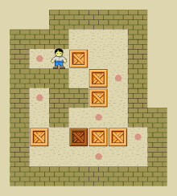

# F202

Réalisation d'un projet jeu vidéo ***sokoban***.

---

## Sokoban
>    Jeu dans lequel on contrôle un personnage se déplaçant sur des cases carrées, le but est de pousser ces boîtes sur des cases cibles.
>*(voir ci_dessous)*

---
### **Pour lancer l'application**
- Assurez vous d'avoir fltk d'installer, si ce n'est pas fait et que vous êtes sur Ubuntu: 

    `sudo apt install libfltk1.3-dev`
- Placez vous à la racine du projet
- tapez: `make`
- une fois fait, faites: `./sokoban`
---
### Touches

| Touche                                                               | Action                            |
|----------------------------------------------------------------------|-----------------------------------|
| <kbd>&uarr;</kbd><kbd>&darr;</kbd><kbd>&larr;</kbd><kbd>&rarr;</kbd> | Diriger personnage                |
| <kbd>Space</kbd>                                                     | Recommencer niveau                |
| <kbd>R</kbd>                                                         | Réinitialiser le record du niveau |
| <kbd>B</kbd>                                                         | Niveau précédent                  |
| <kbd>L</kbd>                                                         | Quitter l'application             |

